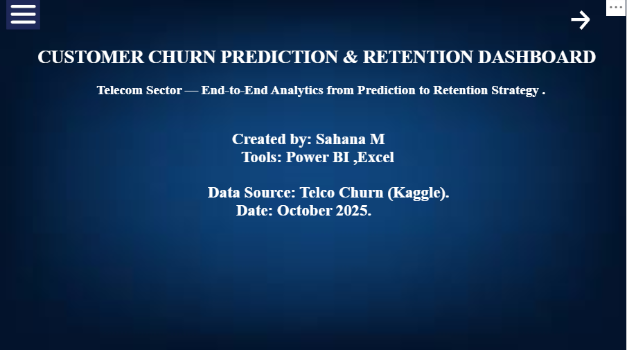
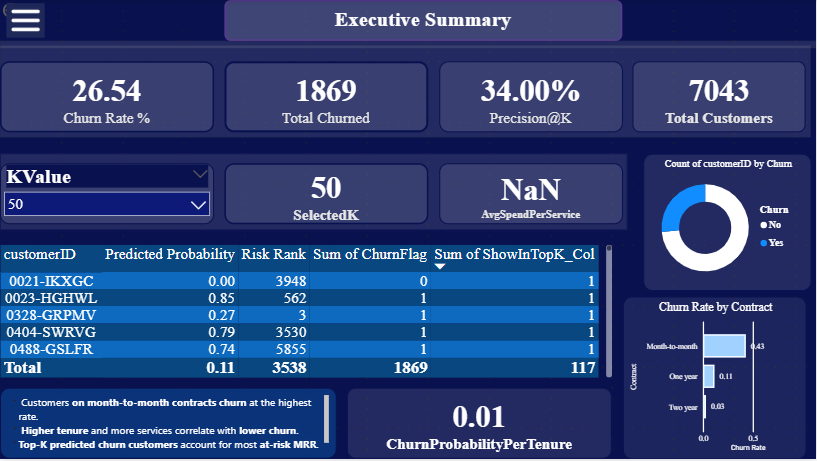
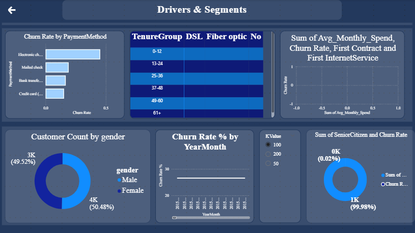
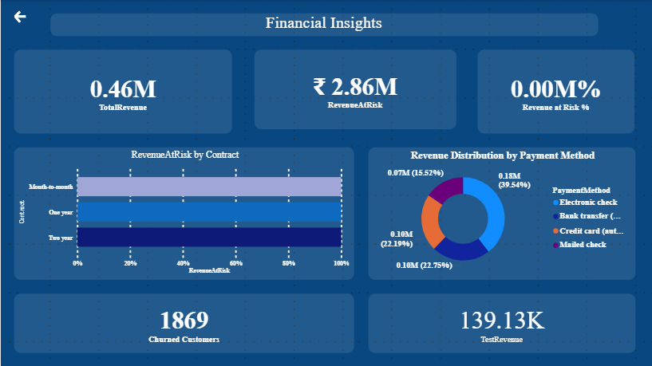
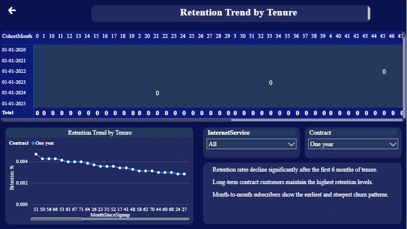
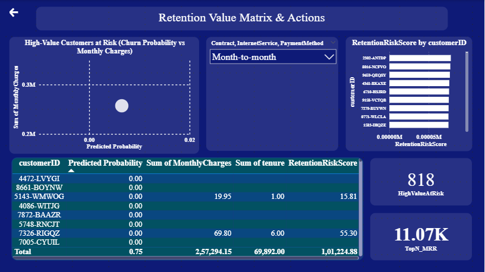

# 📊 Telco Customer Churn Analysis — Power BI Dashboard

**Author:** Sahana Mathad  
**Date:** October 2025  
**Tool:** Microsoft Power BI Desktop

---

## Project Summary

This repository contains a production-ready Power BI project that analyzes customer churn for a telecom operator. The dashboard identifies churn drivers, quantifies revenue at risk, segments customers by risk and value, and provides an action list for retention.

**Primary goals**
- Understand who churns and why.
- Quantify revenue exposure from churn.
- Prioritize high-value customers for retention outreach.
- Provide an interactive dashboard and reproducible project artifacts.

## Repository structure

├─ data/raw/

├─ data/staging/ 

├─ powerbi/pbix/ 

├─ docs/ 
│  ├─ data_dictionary.md 
│  └─ runbook.md

├─ deliverables/ 

└─ screenshots/

## How to view

1. Open `powerbi/pbix/Telco_Customer_Churn.pbix` in Power BI Desktop to interact with the full report locally.  

## Screenshots (folder: `screenshots/`)

The images below are included in the `screenshots/` folder and illustrate each page of the report. Use these previews in the README and the repo to showcase the interactive experience.

- **Home / Landing (preview)** — project landing or title slide used in report exports  
  `screenshots/Home.png`  
  

- **Executive Summary** — top-level KPIs and churn overview  
  `screenshots/Executive_Summary.png`  
  

- **Drivers & Segments** — churn by contract, payment method and service segments  
  `screenshots/Drivers_and_Segments.png`  
  

- **Financial Insights** — total revenue, revenue at risk and what-if scenario controls  
  `screenshots/Financial_Insights.png`  
  

- **Retention by Tenure** — retention and cohort analysis by tenure groups  
  `screenshots/Retention_by_Tenure.png`  
  

- **Retention Value Matrix & Actions** — scatterplot (Predicted Prob × Revenue), Top-N action list  
  `screenshots/Retention_Value_by_Matrix.png`  
  

  
  

## Data & model overview

**Key tables**
- `dim_customer` — customer attributes and contract info (one row per customer).  
- `fact_billing` — billing and churn details (monthly snapshot or transaction-level).  
- `dim_date` — date dimension used for time-based visuals.  
- `dim_tenure` — derived tenure grouping (0–12, 13–24, …).

**Important derived columns**
- `ChurnFlag` = 1 if `Churn = "Yes"` else 0  
- `TenureGroup` = bucketed tenure ranges  
- `PredictedProbability` = model or simulated churn probability (0–1)  
- `RetentionRiskScore` = PredictedProbability × MonthlyCharges (used for ranking)

**Star schema relationships**
- `dim_customer[CustomerID]` → `fact_billing[CustomerID]` (1 → 1)  
- `dim_date[Date]` → `fact_billing[InvoiceDate]` (1 → 1)

**How to reproduce / runbook highlights**

1.Load raw data into data/raw/.

2.Use Power Query transformations to:

3.Trim/clean text fields, convert numeric types.

4.Create ChurnFlag, TenureGroup, NumServices, and other deterministic features.

5.Create dim_customer (one row per customer) and fact_billing (billing snapshot) queries in Power         Query; set proper data types and remove duplicates.

6.Create dim_date table using DAX CALENDAR() and mark as Date table.

7.Build relationships in Model view (as above).

8.Create DAX measures (TotalRevenue, RevenueAtRisk, ChurnRate, Rolling Churn, etc.).

9.Add visuals, format themes, and build the collapsible overlay navigation (Bookmarks + Selection        pane) for compact navigation.

10.Validate numbers by exporting small samples and cross-checking with source CSV.

11.Detailed step-by-step procedures, the full DAX list, and the transformation logic are documented in    docs/runbook.md.
